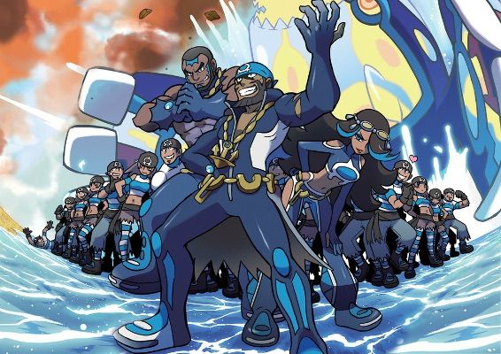

# TEAM AQUA

vanessa: My name is Vanessa, I am person 2, I am not the best at coding but I am tryig to learn. This class is my favourite media design class. I like sewing,pokemon (my favourite ins mimikyu), and drawing. I hope i become better at coding in the near future.

Sophia: My name is Sophia, I am person 1. I'm not experienced with coding but I'm hoping to get really good at it. I've always wanted to learn how to code and program, I took computer science for 2 years in high school and we learned Java and I thought it was fun but it was a little hard. I also like Pokemon, my favourite Pokemon is Slowpoke. I also love doing digital art.

## Contributing

1. Fork it!
2. Create your feature branch: `git checkout -b my-new-feature`
3. Commit your changes: `git commit -am 'Add some feature'`
4. Push to the branch: `git push origin my-new-feature`
5. Submit a pull request :D

## Credits
image provided from pokemon amino
Template provided by Prof TVR. 
Content created by Vanessa Evangelista and Sophia Westrop.

## License

MIT